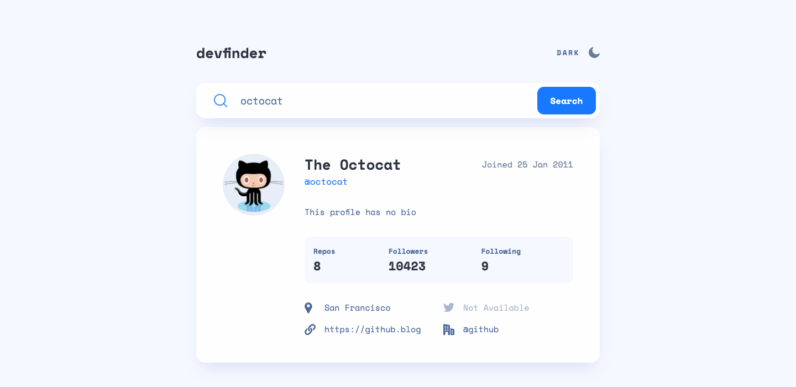
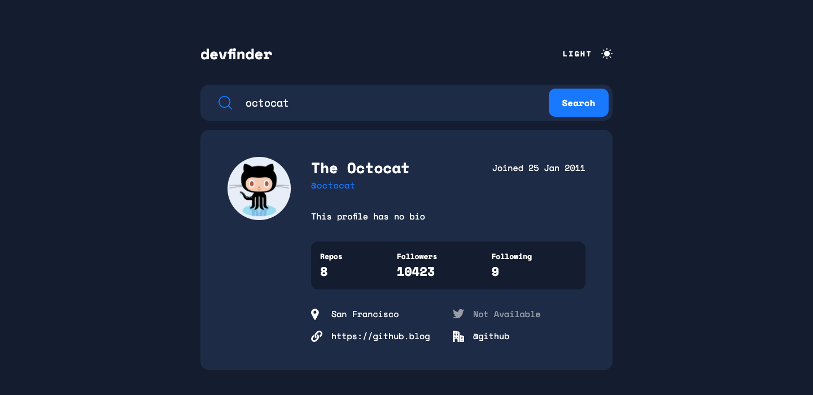
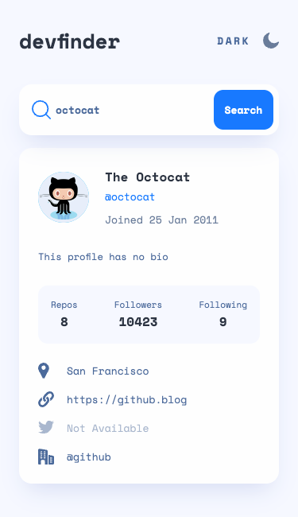
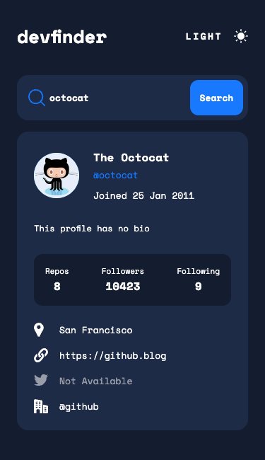

# Frontend Mentor - GitHub user search app solution

This is a solution to the [GitHub user search app challenge on Frontend Mentor](https://www.frontendmentor.io/challenges/github-user-search-app-Q09YOgaH6).

## Table of contents

- [The challenge](#the-challenge)
- [Screenshot](#screenshot)
- [Links](#links)
- [Built with](#built-with)
- [Author](#author)

## The challenge

Users should be able to:

- View the optimal layout for the app depending on their device's screen size
- See hover states for all interactive elements on the page
- Search for GitHub users by their username
- See relevant user information based on their search
- Switch between light and dark themes
- **Bonus**: Have the correct color scheme chosen for them based on their computer preferences. _Hint_: Research `prefers-color-scheme` in CSS.

## Screenshot

|          Desktop Light           |          Desktop Dark           |
| :------------------------------: | :-----------------------------: |
|  |  |

|          Tablet Light           |          Tablet Dark           |
| :-----------------------------: | :----------------------------: |
|  |  |

|          Mobile Light           |          Mobile Dark           |
| :-----------------------------: | :----------------------------: |
|  |  |

## Links

- Solution URL: [Solution](https://www.frontendmentor.io/solutions/github-user-search-app-solution-gsWTlO7x4h)
- Live Site URL: [Live Site](https://github-user-search-app-ardaeker.vercel.app)

## Built with

- Semantic HTML5 markup
- Mobile-first workflow
- [Next.js](https://nextjs.org/) - React framework
- [Tailwind CSS](https://tailwindcss.com) - For styles
- [Framer Motion](https://www.framer.com/motion/) - For animation

## Author

- Website - [www.ardaeker.com](https://ardaeker.com)
- Frontend Mentor - [@ardaeker](https://www.frontendmentor.io/profile/ardaeker)
- Twitter - [@ardaekertr](https://twitter.com/ardaekertr)
